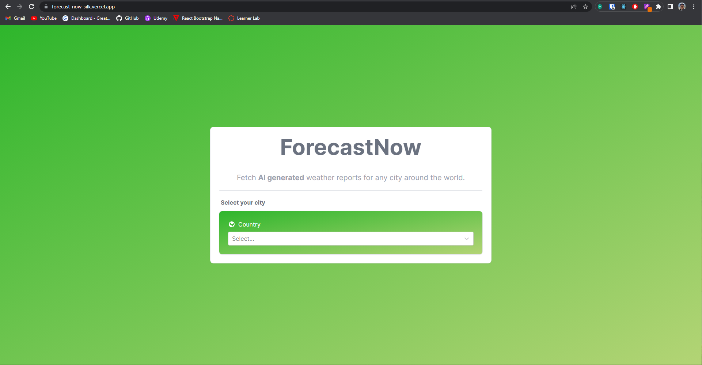
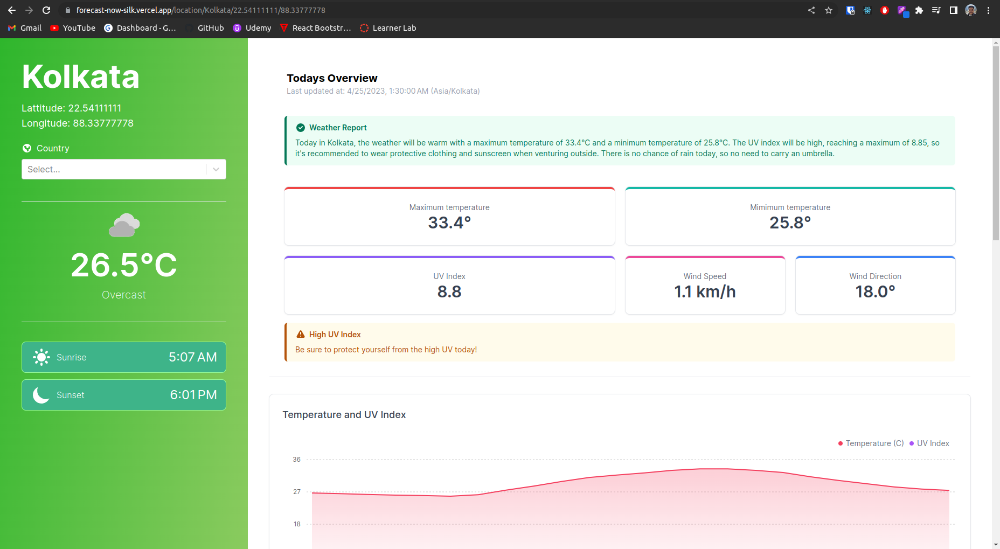
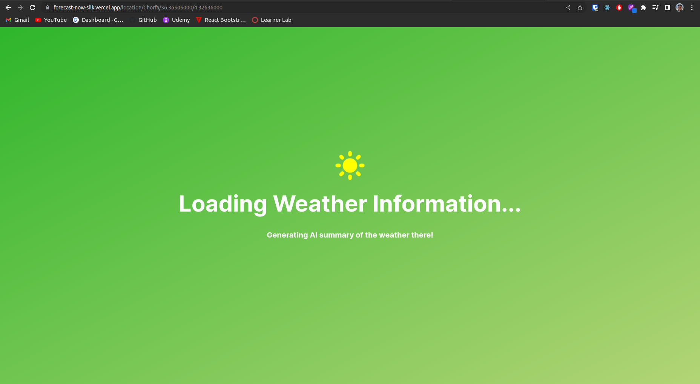
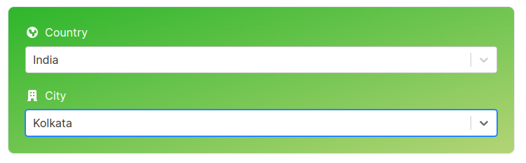
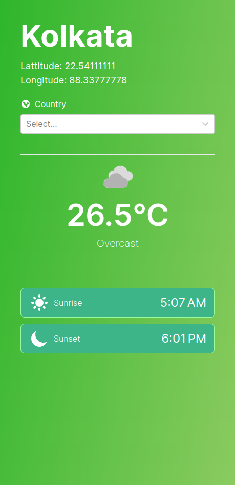
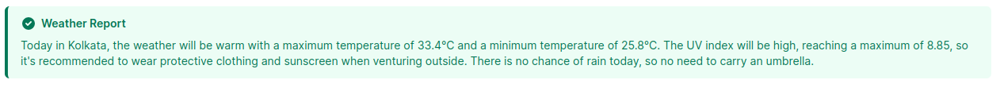
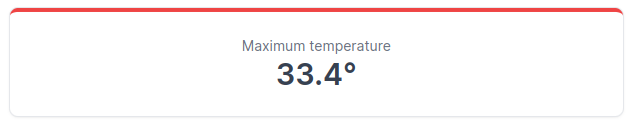
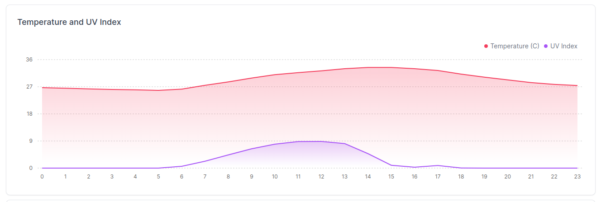

<h1 align="center">ForecastNow 🔆</h1>

### 🌐 [Site](https://forecast-now-silk.vercel.app)

# Features
A full stack weather app to generate a concise weather report of any city of the world:
  - Using 'country-state-city' library, select any city of the world to check weather for
  
  - Fetch current weather conditions of any city which includes current temperature, cloud cover, sunrise and sunset times and so on with the help of 'Open-Meteo' free weather API
  
  - Pictorially display the hourly change in temperature, uv index, rain probability and more with the help of area graphs
  
  - Generate concise summary with suggestions about tackling the weather conditions using GPT-3.5-turbo taking in all the weather data from the API response

# Screenshots
## Pages
### Homepage

### Weather Report

### Loading

## Components
### City Picker

### Information Panel

### Callout Card

### Stat Card

### Area Chart

# Modules
1. Homepage
    - City Picker Select
  
1. Weather Report
    - Information Panel
    - Callout Cards
    - Stat Cards
    - Charts
  
1. Loading

### Homepage
Contains the landing page of the application for user to select the country and city to check the weather for.

### Weather Report
Made up of an info panel and reusable callout, stat and chart components customised using tremor 2.0 library assets. 
Info panel consists of details of city and current weather along with an option to change city. 
Response from GPT-3.5-turbo and excess uv index are shown as a callouts. 
Stat cards are used to show rest of the weather details. 
Hourly changing data such as temperature, uv index, rain probalility, humidity and wind gusts are repesented using reusable chart component.

### Loading
An intermediate page shown until a successful response is received from the weather API and AI.

# Tech
### Frontend
1. React - v18.2.0
1. React Select - v5.7.2
1. Typescript - v5.0.4
1. PostCSS - v8.4.23
1. TailwindCSS - v3.3.1
1. Tremor - v2.2.0
1. Apollo Client - v3.7.12

### Backend
1. Next.js - v13.3.0
1. StepZen
1. GraphQL - v16.6.0

### API
1. county-state-city - v3.1.2
1. OpenAI - 3.2.1

# Setup
### Pre-requisites
1. Download and install the latest version of [Node.js](https://nodejs.org/en/download/current) for development
1. Create an account on [StepZen](https://stepzen.com) and install their [CLI](https://stepzen.com/docs/quick-start/install-and-setup#install-stepzen)
1. Create an account on [OpenAI](https://openai.com/) and create your personal [API Key](https://platform.openai.com/account/api-keys). Keep it noted for reference

### Steps
1. Clone the repo to your folder of choice
1. Open the folder with VSCode (recommended)
1. Open the terminal and install all dependencies using `npm install`
1. Navigate to root level of your project and create a `.env.local` file. The file should contain the following variables -
    - `APP_PORT_NO = 3000`
    - `API_URL = http://localhost:5001/api/forecast-now`
    - `OPENAI_API_KEY` which you have already noted down after creating account on OpenAPI
    - `NEXT_PUBLIC_STEPZEN_API_KEY` which can found in your stepzen [dashboard](https://dashboard.stepzen.com/account)
1. Inside terminal, change directory to 'stepzen' using `cd stepzen`
1. Login to your stepzen account using `stepzen login`. Fill all the details asked using values found in your [account settings](https://dashboard.stepzen.com/account)
1. Start the stepzen backend using `stepzen start --dashboard=local --port=5001`
1. Open another instance of the terminal and run `npm run dev`. Make sure you are at the root level
1. Application will be accessible on `http://localhost:3000`
